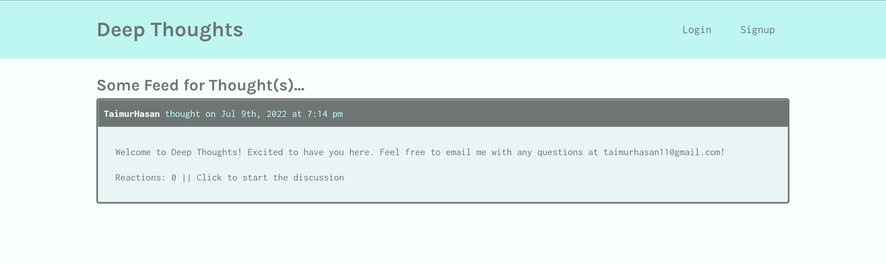
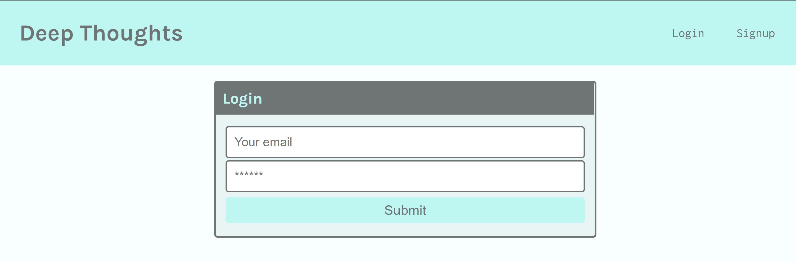
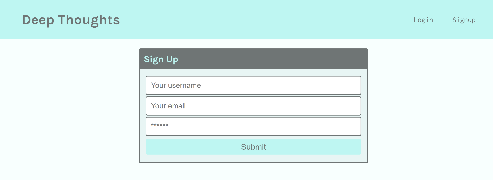
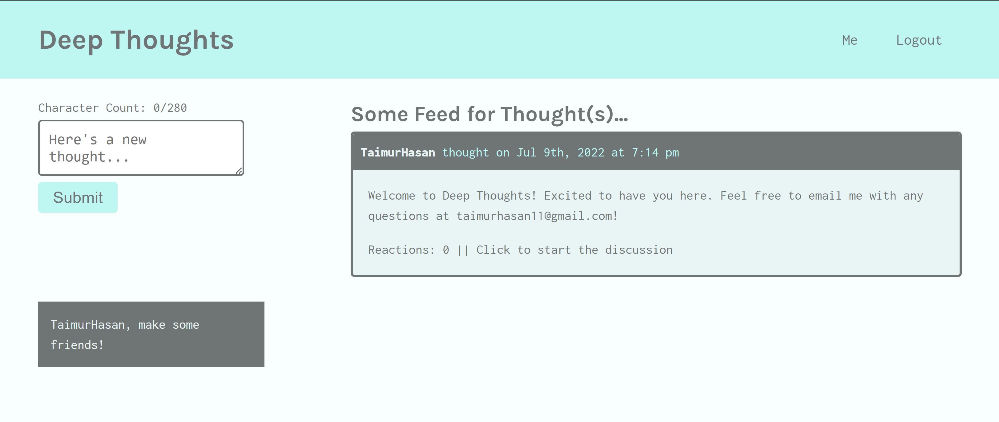
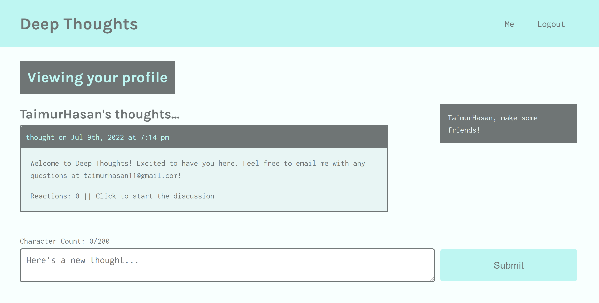

# Deep Thoughts
## Description
[](https://deepthoughtsbytaimur.herokuapp.com/)

<br/>
Deep Thoughts is an online social network, which allows a user to create an account and start posting 'thoughts' and 'reactions'. This project uses JWT user authentication to ensure that only password-protected accounts are able to make, edit, and delete posts or comments. The application also allows users to add other users as friends! <br/>

Note: passwords are encrypted using the bcrypt npm package!
<br/>
<br/>

[](https://opensource.org/licenses/MIT)

**Languages and Technologies Used:** 
- JavaScript ES6
- React
- Node.js
- Express.js
- MongoDB (Mongoose)
- GraphQL

## Table of Contents

1. [ Installation ](#install)
1. [ Usage ](#usage)
2. [ License ](#license)
3. [ Contributing ](#contributing)
4. [ Questions ](#questions)

<a name="install"></a>

## Installation
To run this application locally, follow the steps listed below:
1. Download the latest version of node.js on your computer.
2. Clone this repository on your computer by opening your command-line interface and using git clone and the HTTPS or SSH URL retrieved from this repository's 'Code' dropdown above (e.g. ```git clone git@github.com:TaimurHasan/deep-thoughts.git```).
3. Navigate or cd into the cloned directory from the CLI (i.e. ```cd ./deep-thoughts```).
4. Initialize the NPM registry, as it hosts the required packages needed to run this application, using ```npm init -y```.
5. Install the required packages using ```npm i```.
6. Run the server and client using concurrently with ```npm run develop``` to launch in browser!

<a name="usage"></a>

## Usage
To use this application, please visit the deployed application on [Heroku](https://deepthoughtsbytaimur.herokuapp.com/). <br/>

In order to use the full functionality of this application, please create an account. To create an account, navigate to the 'Login' page from the nav bar and click where prompted to sign up. You will be required to provide a unique username and a password to make an account.

**Login/signup**<br/>




**Homepage (logged in)**<br/>


**Profile**<br/>


<a name="license"></a>
## License
This project is licensed under the MIT License - see the [license info](https://opensource.org/licenses/MIT) for details.


<a name="contributing"></a>

## Contributing

This project can be contributed to by forking the application. For any contributions, please submit a Pull Request, which will be reviewed upon submission before acceptance.

<a name="questions"></a>

## Questions

[GitHub](https://github.com/TaimurHasan) <br/>
For any questions, please send an Email to [taimurhasan11@gmail.com](mailto:taimurhasan11@gmail.com)